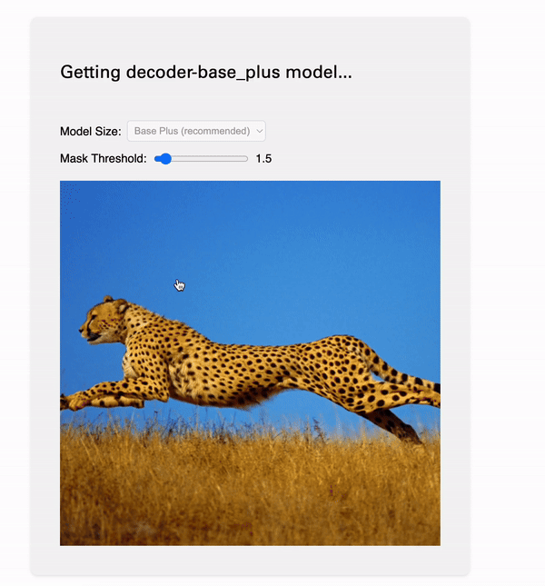

### Segment Anything 2 in WebGPU

This repo includes a WebGPU implementation of Facebook Research's model, [Segment Anything 2](<(https://github.com/facebookresearch/segment-anything-2/tree/main)>) using WebGPU. It runs completely client-side, no data is sent to the server! You can also read my [writeup](http://lucasgelfond.online/portfolio/webgpu-sam2) or try a demo at [http://lucasgelfond.online/webgpu-sam2](http://lucasgelfond.online/webgpu-sam2)

## Instructions

To run the webapp, first install dependencies with `npm i` and then run `npm run start`. I built this using Node ~20, so you may want to adjust your approach.

## Acknowledgements

I made heavy use of prior art here. Some of the most help came from [this](https://github.com/microsoft/onnxruntime/issues/20876) recent ONNX Runtime issue about WebGPU support and from [ibaiGorodo](https://github.com/ibaiGorordo/ONNX-SAM2-Segment-Anything)'s repo that implements SAM 2 inference in Python. Many of my steps for handling the model were translation of this into JS. For dealing with the browser, I made heavy use of [web-sam](https://github.com/neka-nat/web-sam) and [SAM-in-Browser](https://github.com/sunu/SAM-in-Browser).

In order to get the models to work on the web, I also used [SamExporter](https://github.com/vietanhdev/samexporter). A special thank you, of course, to Cursor and Claude 3.5 Sonnet.

## General Structure

This is a pretty standard Svelte app, built to be simple, readable, and performant. I make a lot of use of a convention where new files are in their own folders, and we have an index within them, for easy navigation. It's fairly verbose, but I think it keeps the structure quite clean and easy to navigate, plus stops these files from being thousands of lines long.

The best genral structure I saw came from web-sam, which I took lots of inspiration from. My structure is divided between `decoder` and `encoder`. The encoding process essentially generates a set of features and image embeddings which are needed for creating the masks. The `encoder` also handles standard web stuff, like the file drag-and-drop and selecting the model size.

Every time a user clicks a point, we pass the point of their mouse and the results of encoding to our decoder. It will generate masks, which we display on the canvas. All of the HTML graphics things — adding the image, displaying the masks and contour (mask outline) are handled by special utilities in `decoder/`.

A note that dimensions are baked into the model. SAM 2 can only take 1024x1024 images as inputs and generate 256x256 masks. There's various utilities that make these conversions invisible to the user. For example, `scale-and-process-masks` makes all masks the size of the canvas, and the `process-image` helper in the encoder crops it to this size.

A few quirks: you'll need to install the dev build of onnxruntime, because WebGPU support is quite experimental. There's also a few warnings that aren't suppressed about the execution provider. There's [some](https://github.com/microsoft/onnxruntime/issues/20876#issuecomment-2211833522) [discussion](https://github.com/microsoft/onnxruntime/issues/20876#issuecomment-2214167629) about this and my general conclusion was to not suppress the console, but that these should work. The way the WebGPU bundle is structured is also why I switched off of Vite; you'll note this project builds with Webpack, which is certainly a bit finicky.

## Fetching Models

I initially planned to simply put the models into the build, but both Vercel and GitHub have 100 MB limits, typically okay for the decoders (~20 MB) but all of the encoders I could process topped 100 MB. These loads also took a long time to do each time we wanted to run inference.

As such, I store the models in the user's browser after first download. I'm using [origin private file system](https://developer.mozilla.org/en-US/docs/Web/API/File_System_API/Origin_private_file_system) which can save and access reasonably large files. My understanding, for example, Chrome will store up to 2 GB or 20% of free disk space (whatever is smaller) per website. In essence, given a model, we check to see if it is in the cache, and if not, we fetch it.

## Optimizing Segment Anything 2 Models for the web

If the models are updated, or you decide to fine-tune them, the process for actually getting them into the browser is fairly straightforward but non-obvious. Here's the method I settled on:

- Clone the original [Facebook Research Segment Anything 2](https://github.com/facebookresearch/segment-anything-2/tree/main)
- Install as instructed (just `pip install -e .`) and use their `download_ckpts.sh` script. (Or, skip the script and copy/paste the URLs into your browser, LOL)
- Install [samexporter](https://github.com/vietanhdev/samexporter), which has support for converting models to ONNX format, which we need for hte ONNX runtime under the hood.
- Use the `samexporter` scripts to split the models into encoder/decoder and save the results. This worked for me up to the large model, where my 2023 Macbook Pro ran out of memory. YMMV! Anyways, there's a handy `convert_all_meta_sam2.sh` script, or you can do it manually.

`python -m samexporter.export_sam2 --checkpoint original_models/sam2_hiera_base_plus.pt \
    --output_encoder output_models/sam2_hiera_base_plus.encoder.onnx \
    --output_decoder output_models/sam2_hiera_base_plus.decoder.onnx \
    --model_type sam2_hiera_base_plus`

- Install the onnxruntime on Python. I already had it installed, but `pip install onnxruntime` should do the trick if you don't already.
- You can then use their [built in utility](https://onnxruntime.ai/docs/performance/model-optimizations/ort-format-models.html) to optimize the models to .ORT format, like so:

`python -m onnxruntime.tools.convert_onnx_models_to_ort sam2_hiera_base_plus.encoder.onnx
`

- This process will split a bunch of files. The only one you want is the .ort file called something like `sam2_hiera_base_plus.encoder.with_runtime_opt.ort`. You can ignore the other files.
